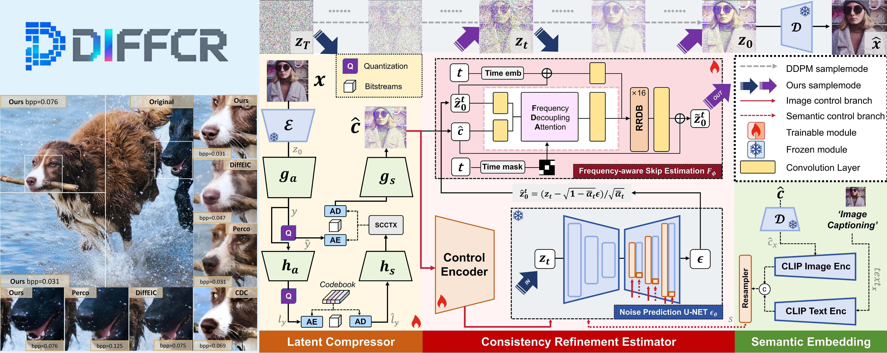
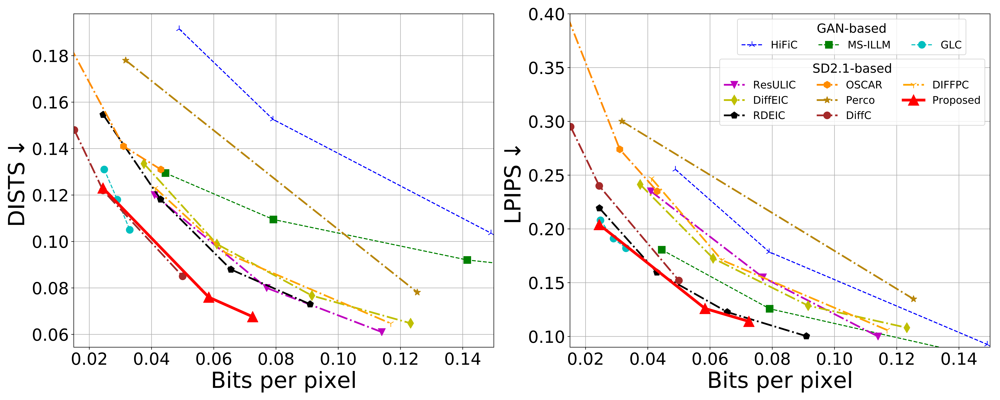
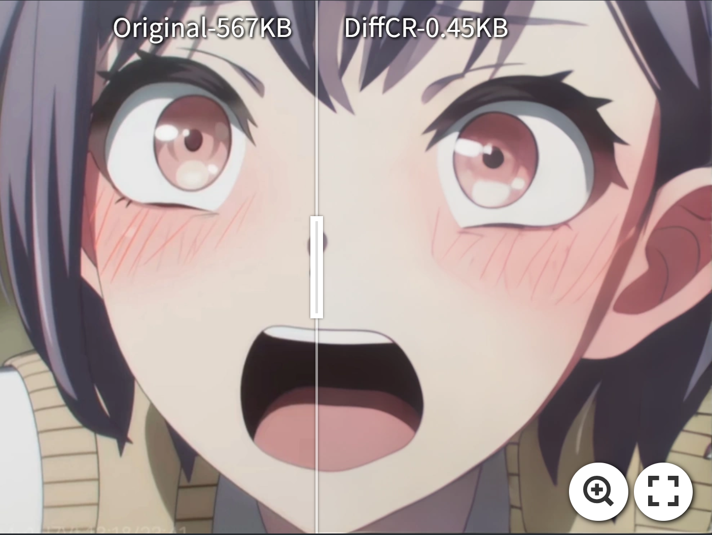
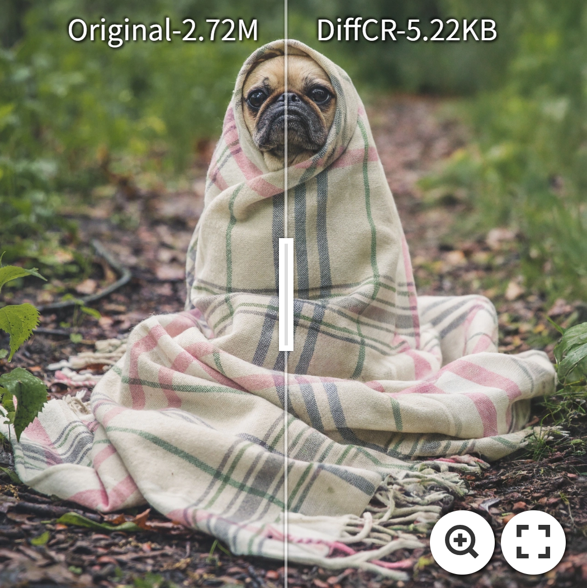
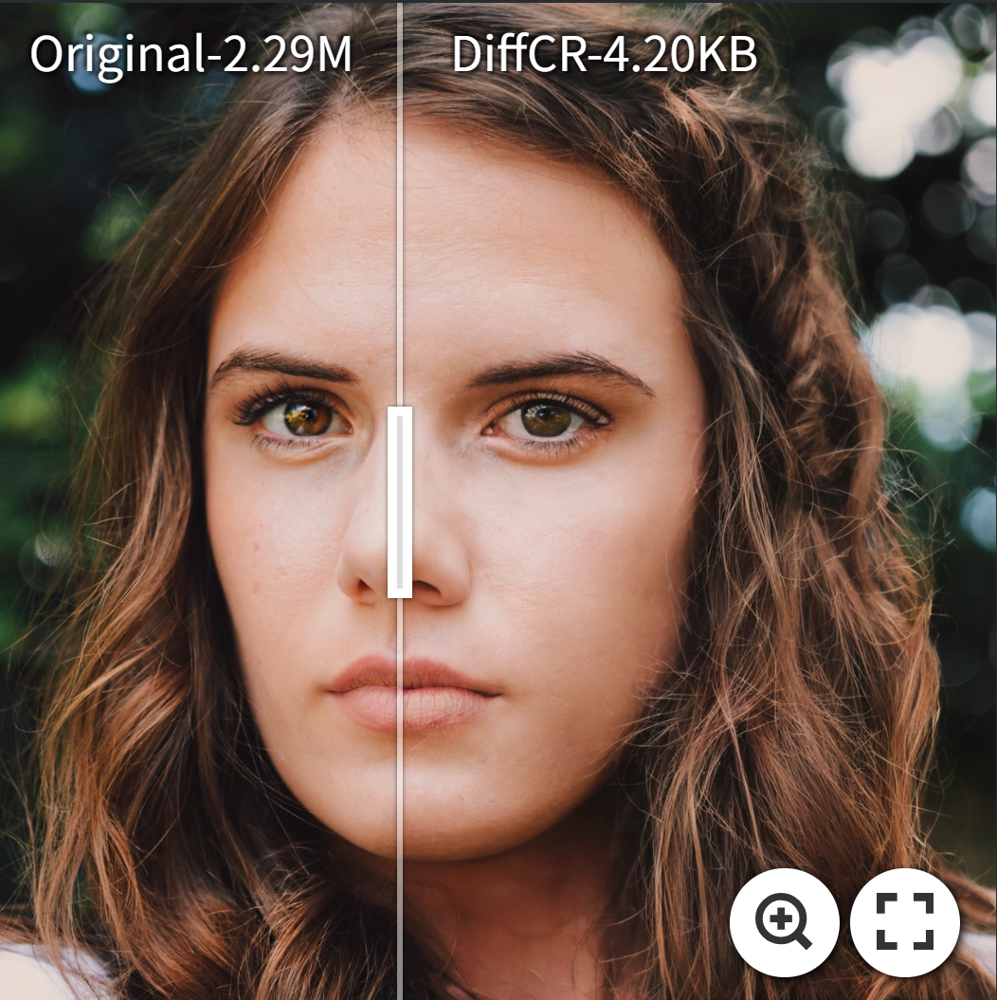
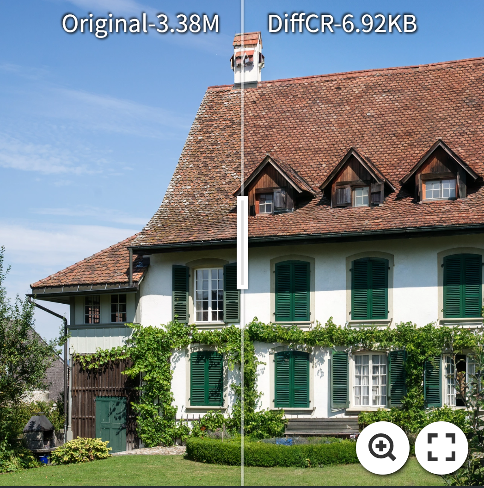

# Towards Efficient Low-rate Image Compression with Frequency-aware Diffusion Prior Refinement 
> Yichong Xia, Yimin Zhou, Jinpeng Wang, Bin Chen<br>
> :sunglasses: This work is accepted by AAAI-26
>
## <a name="cite"></a>:cat: The overall pipeline of DiffCR
<p align="center">
    <br>
</p>

## <a name="cite"></a>:microscope: Performance
### Quantitative Performance on Kodak </summary>
<p align="center">
    <br>
</p>

###  Qualitative Performance; Visualization </summary>
<div align="center">
    <table style="width: 80%; border-collapse: collapse;">
        <tr>
            <td align="center" style="width: 50%;">
                <a href="https://imgsli.com/NDUyMzMw">
                    <br>
                </a>
            </td>
            <td align="center" style="width: 50%;">
                <a href="https://imgsli.com/NDUyMzI0">
                    <br>
                </a>
            </td>
        </tr>
        <tr>
            <td align="center">
                <a href="https://imgsli.com/NDUyMzI3">
                    <br>
                </a>
            </td>
            <td align="center">
                <a href="https://imgsli.com/NDUyMzIx">
                    <br>
                </a>
            </td>
        </tr>
    </table>
</div>

## <a name="cite"></a>:wrench: Preparation

1. Download pretrained [Stable Diffusion v2.1](https://huggingface.co/stabilityai/stable-diffusion-2-1-base) into `./ckpt/SD21`.
   ```
   wget https://huggingface.co/stabilityai/stable-diffusion-2-1-base/resolve/main/v2-1_512-ema-pruned.ckpt --no-check-certificate
   ```
2. Download pretrained CLIP model (https://huggingface.co/laion/CLIP-ViT-H-14-laion2B-s32B-b79K) into `./ckpt/SD21`.


3. Download pretrained DiffCR into `./ckpt/CR_model`.
https://pan.quark.cn/s/bd196bad2f3a?pwd=Fq9f CODE=Fq9f
```
cr_highbits_6.ckpt : ~0.06 bpp kodak
cr_medhighbits_8.ckpt : ~0.04 bpp kodak
cr_medbits_12.ckpt : ~0.03 bpp kodak
cr_lowbits_18.ckpt : ~0.02 bpp kodak
   ```
## <a name="cite"></a>:computer: Inference
You can invoke the inference.py file to use the inference function. The inference results will generate decoded images and theoretical bpp values. The encoding and decoding code will be released soon.

```
python3 Inference.py \
--model_dir ./ckpt/CR_model/cr_model.ckpt \
--base_diffusion_ckpt ./ckpt/SD21/v2-1_512-ema-pruned.ckpt  \
--config_dir ./Configs/evalX.yaml \
--img_path ./test_pic/anime.png \
--prompt 'A close-up of an anime girl with wide eyes, blushing cheeks, and an open mouth, expressing intense shock or excitement.'\
--output_dir ./ \
--device cuda
   ```

## <a name="cite"></a>:scroll: Citation


Please cite us if our work is useful for your research.
```
@article{xia2026towards,
  title={Towards Efficient Low-rate Image Compression with Frequency-aware Diffusion Prior Refinement},
  author={Xia, Yichong and Zhou, Yimin and Wang, Jinpeng and Chen, Bin},
  journal={arXiv preprint arXiv:2601.10373},
  year={2026}
}
```


